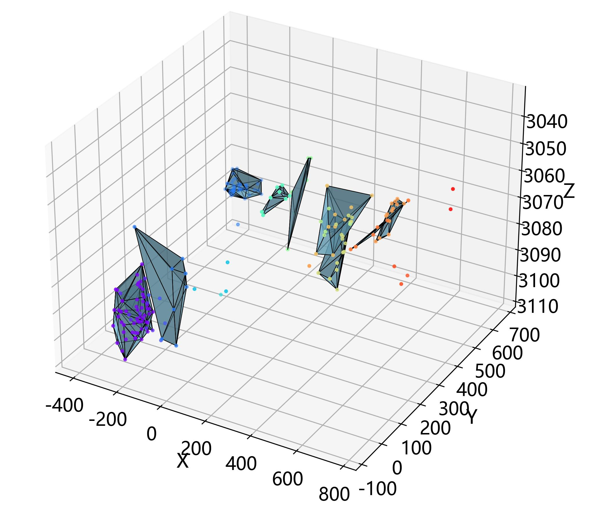

# **stimulate reservoir volume calculation**
 

## Paper Support
- Original information: A Calculation Method of Stimulated Reservoir Volume Based on Microseismic Events and Its Application
- Recruitment Journal: Chinese Journal of Underground Space and Engineering
- Original DOI: https://doi.org/ CNKI:SUN:BASE.0.2019-S1-018
***
## Description of the project
Stimulated reservoir volume (SRV) is the most critical index to represent the hydraulically fractured volume after stimulation. The existing models using microseismic events usually lack a sufficient unified basis on the geometric definition, leading to significant differences in SRV calculation and interpretation. A novel SRV calculation method is proposed based on the alpha shape method. Then, we have developed an integrated workflow based on synthetic events to evaluate the performance quantitatively under different fracture configurations and noise ratios. Through a large number of simulated calculations, it is indicated that the proposed method has good accuracy, adaptability, and anti-noise ability for complex fracture networks with different configurations. The proposed methods provide helpful guidance for developing more superior SRV calculation methods.
***
## Functions of the project
Calculation and visualization of stimulated reservoir volume (SRV) with 3D microseismic data.
***
## The operating environment of the project
-	Python == 3.7.0
-	alphashape == 1.3.1
-	descartes == 1.1.0
-	pandas == 1.1.5
-	scipy == 1.7.3
-	numpy == 1.21.6
-	matplotlib == 3.5.1
-	joblib == 1.1.0
-	time == 3.7.0
-	sklearn == 1.0.2
***
## How to use the project
-	Ashape.py is designed for Function 1. It can generate an alpha shape of 3D microseismic data. Users can directly obtain the SRV through calculating the volume of alpha shape.

